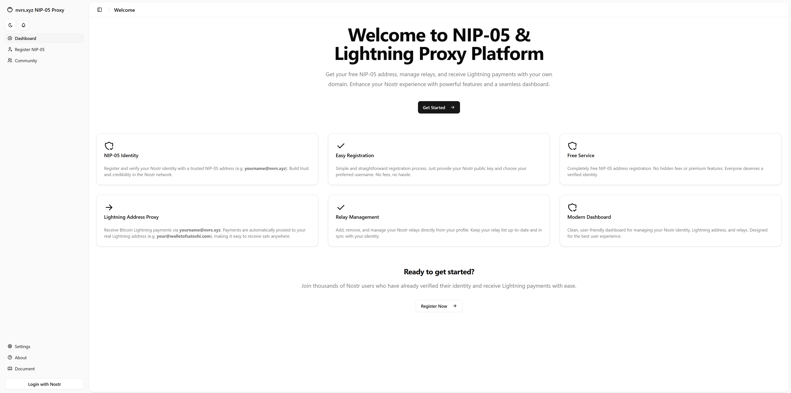

# nvrs.xyz NIP-05 Proxy

A modern, open-source dashboard for managing your Nostr identity, relays, and Lightning Address proxying on nvrs.xyz.  
Built with Next.js, Supabase, and AI-assisted development.

 <!-- (เพิ่ม screenshot ถ้ามี) -->

---

## Features

- **NIP-05 Identity**: Register and verify your Nostr identity with a trusted NIP-05 address (e.g. `yourname@nvrs.xyz`).
- **Lightning Address Proxy**: Receive Bitcoin Lightning payments via your NIP-05 address, automatically proxied to your real Lightning Address.
- **Relay Management**: Add, remove, and manage your Nostr relays directly from your profile.
- **Modern Dashboard**: Clean, responsive UI with dark/light mode, built for the best user experience.
- **Community Page**: Discover and search all registered users, with merged Nostr metadata from multiple relays.
- **Secure & Free**: No fees, no hidden costs. Your data is stored securely in Supabase and can be deleted at any time.

---

## Getting Started

1. **Clone the repository**
   ```bash
   git clone https://github.com/yourusername/nvrs.xyz-nip05-proxy.git
   cd nvrs.xyz-nip05-proxy
   ```

2. **Install dependencies**
   ```bash
   npm install
   # or
   yarn install
   ```

3. **Set up environment variables**
   - Copy `.env.example` to `.env.local` and fill in your Supabase credentials and any other required secrets.

4. **Run the development server**
   ```bash
   npm run dev
   # or
   yarn dev
   ```

5. Open [http://localhost:3000](http://localhost:3000) in your browser.

---

## How It Works

- **Register NIP-05**: Sign up with your Nostr public key and username to get a free NIP-05 address.
- **Manage Profile**: Edit your username, Lightning Address, and relay list in one place.
- **Receive Lightning Payments**: Use your NIP-05 address as a Lightning Address; payments are proxied to your configured wallet.
- **Community**: Browse all users and their Nostr metadata, fetched and merged from popular relays.

---

## Tech Stack

- [Next.js](https://nextjs.org/) (App Router)
- [Supabase](https://supabase.com/) (Database & Auth)
- [next-themes](https://github.com/pacocoursey/next-themes) (Dark/Light mode)
- [Tailwind CSS](https://tailwindcss.com/) (UI styling)
- [Nostr Tools](https://github.com/nbd-wtf/nostr-tools) (Nostr protocol)
- [Radix UI](https://www.radix-ui.com/) & [shadcn/ui](https://ui.shadcn.com/) (UI components)
- [TypeScript](https://www.typescriptlang.org/)

---

## FAQ

**What is NIP-05?**  
NIP-05 is a standard for identity verification on Nostr, using the format `username@domain` (e.g. `yourname@nvrs.xyz`).

**What is Lightning Address Proxy?**  
It lets you receive sats using your NIP-05 address. The system proxies payments to your configured Lightning Address (e.g. `your@walletofsatoshi.com`).

**Is my data safe?**  
Your data is stored securely in Supabase. You can delete your account at any time.

**Can I change my Username or Lightning Address?**  
Yes, you can update them anytime from the Profile page.

**Which apps are supported?**  
All Nostr apps that support NIP-05 and all Lightning apps that support LNURL-pay (e.g. Wallet of Satoshi, Alby, Zeus, etc.)

---

## License

MIT

---

> This project was built with the help of AI tools for rapid prototyping, code generation, and UI/UX design.
